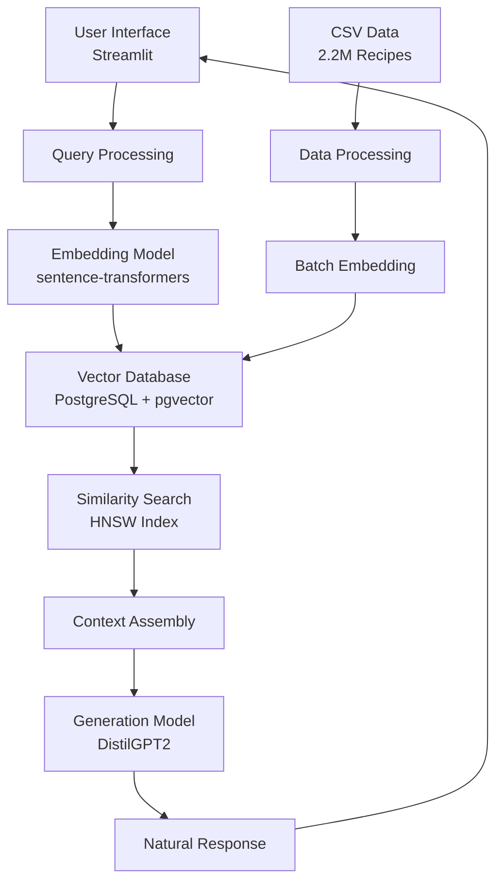

# 🍳 Master Chef

A production-ready Retrieval-Augmented Generation (RAG) assistant for searching through millions of recipes using PostgreSQL with pgvector and advanced NLP techniques.

## 📋 Table of Contents

- [🎯 Project Overview](#-project-overview)
- [🤖 What is RAG?](#-what-is-rag)
- [🏗️ Architecture](#️-architecture)
- [⚙️ Installation](#️-installation)
- [🚀 Quick Start](#-quick-start)
- [📚 Detailed Documentation](#-detailed-documentation)

## 🎯 Project Overview

Master Chef is an intelligent conversational AI system that can:
- 🔍 **Semantic Search**: Find recipes by meaning, not just keywords
- ⚡ **Fast Responses**: <100ms search on 2M+ recipes
- 💬 **Natural Conversations**: Answer cooking questions in natural language
- 🔄 **Resumable Processing**: Stop and resume data population anytime
- 📊 **Real-time Monitoring**: Watch progress live

### Key Features
- **Vector Database**: PostgreSQL with pgvector for efficient similarity search
- **Advanced Embeddings**: Multilingual sentence transformers for semantic understanding
- **Scalable Architecture**: Designed to handle millions of recipes efficiently
- **Interactive UI**: Beautiful Streamlit interface with chat functionality
- **Progress Tracking**: Robust progress saving and resumption capabilities

## 🤖 What is RAG?

**Retrieval-Augmented Generation (RAG)** is a cutting-edge AI architecture that combines:

1. **Retrieval**: Searching through a large knowledge base (our recipe database)
2. **Augmentation**: Using retrieved information as context
3. **Generation**: Creating natural language responses based on that context

### How RAG Works in Our System

```
User Query → Embedding → Vector Search → Retrieved Recipes → Context → LLM → Response
```

#### Step-by-Step Process:

1. **Query Understanding**:
   - User asks: "How do I make a chocolate cake?"
   - Query is converted to a 384-dimensional vector embedding

2. **Semantic Search**:
   - Vector similarity search finds recipes most similar to the query
   - Searches through 2M+ recipes in <100ms using HNSW indexing

3. **Context Building**:
   - Top matching recipes are formatted as context
   - Includes ingredients, instructions, and similarity scores

4. **Response Generation**:
   - LLM (DistilGPT2) generates a helpful response
   - Response is based on actual recipe data, not hallucinations

### Benefits of RAG

✅ **Accurate**: Responses based on real recipe data
✅ **Up-to-date**: Easy to update with new recipes
✅ **Explainable**: Can show source recipes for responses
✅ **Efficient**: No need to retrain entire models
✅ **Scalable**: Handles millions of recipes effortlessly

## 🏗️ Architecture

### System Architecture



### Database Schema

```sql
-- Main recipes table
CREATE TABLE recipes (
    id SERIAL PRIMARY KEY,
    title TEXT NOT NULL,
    ingredients TEXT[],  -- Array of ingredients
    directions TEXT,     -- Cooking instructions
    source TEXT,         -- Data source
    chunk_text TEXT NOT NULL,  -- Combined text for embedding
    embedding vector(384),     -- Vector representation
    created_at TIMESTAMP DEFAULT CURRENT_TIMESTAMP
);

-- Metadata tracking
CREATE TABLE embedding_metadata (
    id SERIAL PRIMARY KEY,
    model_name VARCHAR(255) NOT NULL,
    embedding_dimension INTEGER NOT NULL,
    total_recipes INTEGER DEFAULT 0,
    dataset_version VARCHAR(50),
    created_at TIMESTAMP DEFAULT CURRENT_TIMESTAMP
);

-- Progress tracking
CREATE TABLE population_status (
    id SERIAL PRIMARY KEY,
    status TEXT NOT NULL,
    processed INTEGER DEFAULT 0,
    total INTEGER DEFAULT 0,
    error_message TEXT,
    updated_at TIMESTAMP DEFAULT CURRENT_TIMESTAMP
);
```

### Technology Stack

| Component | Technology | Purpose |
|-----------|------------|---------|
| **Database** | PostgreSQL 14+ with pgvector | Vector storage and similarity search |
| **Embedding Model** | paraphrase-multilingual-MiniLM-L12-v2 | Convert text to 384-dim vectors |
| **Generation Model** | DistilGPT2 | Generate natural language responses |
| **Frontend** | Streamlit 1.52+ | Interactive web interface |
| **Backend** | Python 3.8+ | Core logic and data processing |
| **Vector Index** | HNSW (m=16, ef_construction=64) | Fast approximate nearest neighbor search |

## ⚙️ Installation

### Prerequisites

- **Python 3.8+**
- **PostgreSQL 14+** with pgvector extension
- **8GB+ RAM** (for full dataset processing)
- **2.2GB disk space** (for data)

### 1. Clone the Repository


### 2. Create Virtual Environment

```bash
python -m venv .venv

# Windows
.venv\Scripts\activate

# Linux/Mac
source .venv/bin/activate
```

### 3. Install Dependencies

```bash
pip install -r requirements.txt
```

### 4. Setup PostgreSQL with pgvector

#### Ubuntu/Debian:
```bash
sudo apt-get install postgresql-14 postgresql-14-pgvector
```

#### macOS:
```bash
brew install postgresql@14 pgvector
```

#### Windows:
1. Download PostgreSQL installer from postgresql.org
2. Install pgvector extension following: https://github.com/pgvector/pgvector

### 5. Configure Database

Edit `utils.py` and `database_setup.py` with your PostgreSQL credentials:

```python
DB_CONFIG = {
    'dbname': 'recipe_rag',
    'user': 'postgres',
    'password': 'your_password',  # Update this!
    'host': 'localhost',
    'port': '5432'
}
```

## 🚀 Quick Start

### Option 1: Using the Launcher Scripts

#### Windows:
```cmd
scripts\start.bat
```

#### Linux/Mac:
```bash
chmod +x scripts/start.sh
./scripts/start.sh
```

### Option 2: Manual Steps

1. **Setup Database** (first time only):
```bash
python database_setup.py
```

2. **Populate with Recipes** (first time only):
```bash
python populate_data.py --csv full_dataset.csv
```

3. **Run the Chatbot**:
```bash
streamlit run app.py
```

4. **Monitor Progress** (optional):
```bash
python scripts/monitor_progress.py
```

## 📚 Documentation

All documentation is now contained within this README file. It includes:
- Complete setup and installation guide
- Architecture overview
- Configuration options
- Performance metrics
- Troubleshooting section
- Development guidelines

## 🔧 Configuration

### Database Settings

Located in `utils.py`:

```python
DB_CONFIG = {
    'dbname': 'recipe_rag',
    'user': 'postgres',
    'password': 'root',  # Change this!
    'host': 'localhost',
    'port': '5432'
}
```

### Model Settings

In `utils.py`:

```python
# Embedding model
EMBEDDING_MODEL = 'paraphrase-multilingual-MiniLM-L12-v2'
EMBEDDING_DIM = 384

# Generation model
GENERATION_MODEL = 'distilgpt2'
```

### Processing Parameters

In `populate_data_v2.py`:

```python
BATCH_SIZE = 5000        # Recipes per batch
CHUNK_SIZE = 5000        # Embeddings per generation
SAVE_INTERVAL = 1000     # Save progress every N recipes
AUTOSAVE_INTERVAL = 300  # Auto-save every N seconds
```

### Search Parameters

Adjustable in the Streamlit UI:

- **Recipes to retrieve**: 1-10 (default: 3)
- **Minimum similarity**: 0.0-1.0 (default: 0.3)

## 📊 Performance

| Metric | Value |
|--------|-------|
| **Recipes Indexed** | 2.2M+ |
| **Search Latency** | <100ms |
| **Embedding Dimension** | 384 |
| **Index Type** | HNSW (approximate nearest neighbor) |
| **Processing Time** | ~30 hours for 2.2M recipes |
| **Memory Required** | 8GB+ (full dataset) |
| **Storage Space** | 2.2GB (CSV) + ~10GB (database) |

### Performance Optimizations

1. **Vector Indexing**:
   - HNSW index for sub-100ms vector search
   - Optimized parameters: m=16, ef_construction=64

2. **Batch Processing**:
   - Processes 5,000 recipes per batch
   - Generates embeddings in chunks of 5,000

3. **Memory Management**:
   - Clears data after each batch
   - Uses generators for CSV reading

4. **Database Optimizations**:
   - GIN indexes on ingredients and title
   - Vector index for similarity search

## 🛠️ Development

### Project Structure

```
ChatBot/
├── 📱 Application
│   ├── app.py                 # Main Streamlit app
│   ├── utils.py               # Core utilities
│   └── requirements.txt       # Dependencies
│
├── 🗄️ Database
│   ├── database_setup.py      # Database initialization
│   └── populate_data.py       # Data population with progress
│
├── 🛠️ Scripts
│   ├── scripts/
│   │   ├── start.sh           # Linux/Mac launcher
│   │   ├── start.bat          # Windows launcher
│   │   └── monitor_progress.py # Progress monitor
│
└── 📄 Data
    ├── full_dataset.csv       # Recipe dataset
    └── RecipeNLG_dataset.csv  # Original dataset
```

### Testing

```bash
# Test database connection
python -c "from utils import Database; db = Database(); print(db.connect())"

# Test embedding model
python -c "from utils import EmbeddingModel; emb = EmbeddingModel(); emb.load(); print(emb.encode('test').shape)"

# Test population
python populate_data.py --csv full_dataset.csv --test
```

## 🐛 Troubleshooting

### Common Issues

#### 1. PostgreSQL Connection Error
```bash
Error: FATAL: database "recipe_rag" does not exist
```
**Solution**: Run `python database_setup.py` first

#### 2. pgvector Extension Not Found
```bash
Error: extension "vector" does not exist
```
**Solution**: Install pgvector extension following official guide

#### 3. Memory Errors During Population
```bash
MemoryError: Unable to allocate array
```
**Solution**: Reduce `BATCH_SIZE` and `CHUNK_SIZE` in `populate_data_v2.py`

#### 4. Slow Search Performance
**Symptoms**: Search taking >1 second
**Solutions**:
- Check vector index exists
- Verify HNSW index parameters
- Consider increasing `ef_search` parameter

#### 5. Model Download Issues
```bash
OSError: Can't load tokenizer for 'distilgpt2'
```
**Solution**: Check internet connection and HuggingFace access

### Debug Mode

Enable debug logging by adding to the top of your script:

```python
import logging
logging.basicConfig(level=logging.DEBUG)
```

### Monitoring Progress

```bash
# Terminal 1: Run population
python populate_data.py --csv full_dataset.csv

# Terminal 2: Monitor progress
python scripts/monitor_progress.py
```


### Acknowledgments

- [pgvector](https://github.com/pgvector/pgvector) for vector similarity search
- [sentence-transformers](https://github.com/UKPLab/sentence-transformers) for embeddings
- [Hugging Face](https://huggingface.co/) for pre-trained models
- [Streamlit](https://streamlit.io/) for the web framework

**Start now:**
```bash
streamlit run app.py
```

Become a Master Chef with AI! 🍳🤖
