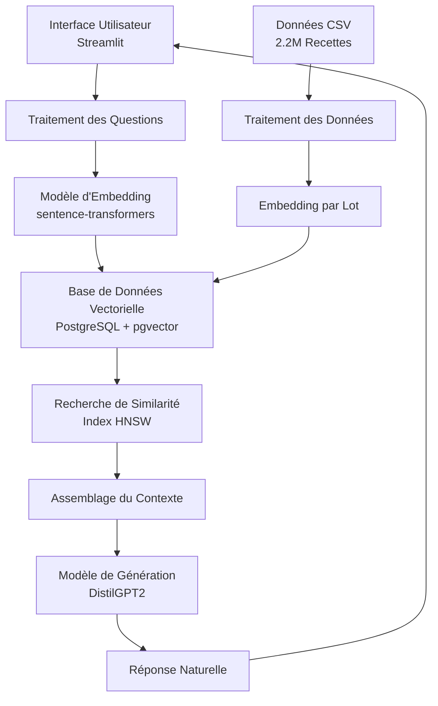

# 🍳 Master Chef

Un assistant RAG (Retrieval-Augmented Generation) prêt pour la production, capable de rechercher parmi des millions de recettes en utilisant PostgreSQL avec pgvector et des techniques avancées de NLP.

## 📋 Table des Matières

- [🎯 Vue d'ensemble du Projet](#-vue-densemble-du-projet)
- [🤖 Qu'est-ce que RAG ?](#-quest-ce-que-rag)
- [🏗️ Architecture](#️-architecture)
- [⚙️ Installation](#️-installation)
- [🚀 Démarrage Rapide](#-démarrage-rapide)
- [📚 Documentation Détaillée](#-documentation-détaillée)
- [🔧 Configuration](#-configuration)
- [📊 Performance](#-performance)
- [🛠️ Développement](#️-développement)
- [🐛 Dépannage](#-dépannage)
- [🤝 Contribuer](#-contribuer)
- [📄 Licence](#-licence)

## 🎯 Vue d'ensemble du Projet

Master Chef est un système AI conversationnel intelligent capable de :
- 🔍 **Recherche Sémantique** : Trouver des recettes par leur sens, pas seulement par mots-clés
- ⚡ **Réponses Rapides** : <100ms pour rechercher parmi 2M+ de recettes
- 💬 **Conversations Naturelles** : Répondre aux questions de cuisine en langage naturel
- 🔄 **Traitement Reprisable** : Arrêter et reprendre le peuplement des données à tout moment
- 📊 **Surveillance en Temps Réel** : Voir la progression en direct

### Fonctionnalités Principales
- **Base de Données Vectorielle** : PostgreSQL avec pgvector pour une recherche de similarité efficace
- **Embeddings Avancés** : Transformers de phrases multilingues pour la compréhension sémantique
- **Architecture Évolutive** : Conçu pour gérer des millions de recettes efficacement
- **Interface Interactive** : Magnifique interface Streamlit avec fonctionnalité de chat
- **Suivi de Progression** : Sauvegarde robuste de la progression et capacités de reprise

## 🤖 Qu'est-ce que RAG ?

**Retrieval-Augmented Generation (RAG)** est une architecture IA de pointe qui combine :

1. **Récupération** : Rechercher dans une large base de connaissances (notre base de données de recettes)
2. **Augmentation** : Utiliser les informations récupérées comme contexte
3. **Génération** : Créer des réponses en langage naturel basées sur ce contexte

### Comment RAG Fonctionne dans Notre Système

```
Question Utilisateur → Embedding → Recherche Vectorielle → Recettes Récupérées → Contexte → LLM → Réponse
```

#### Processus Étape par Étape :

1. **Compréhension de la Question** :
   - L'utilisateur demande : "Comment faire un gâteau au chocolat ?"
   - La question est convertie en un embedding vectoriel de 384 dimensions

2. **Recherche Sémantique** :
   - La recherche de similarité vectorielle trouve les recettes les plus similaires à la question
   - Recherche parmi 2M+ de recettes en <100ms en utilisant l'indexation HNSW

3. **Construction du Contexte** :
   - Les recettes correspondantes les plus pertinentes sont formatées comme contexte
   - Inclut les ingrédients, instructions et scores de similarité

4. **Génération de Réponse** :
   - LLM (DistilGPT2) génère une réponse utile
   - La réponse est basée sur des données de recettes réelles, pas d'hallucinations

### Avantages de RAG

✅ **Précis** : Réponses basées sur des données de recettes réelles
✅ **À Jour** : Facile à mettre à jour avec de nouvelles recettes
✅ **Explicable** : Peut montrer les recettes sources pour les réponses
✅ **Efficace** : Pas besoin de re-entraîner les modèles entiers
✅ **Évolutif** : Gère des millions de recettes sans effort

## 🏗️ Architecture

### Architecture du Système



### Schéma de la Base de Données

```sql
-- Table principale des recettes
CREATE TABLE recipes (
    id SERIAL PRIMARY KEY,
    title TEXT NOT NULL,
    ingredients TEXT[],  -- Tableau d'ingrédients
    directions TEXT,     -- Instructions de cuisine
    source TEXT,         -- Source des données
    chunk_text TEXT NOT NULL,  -- Texte combiné pour l'embedding
    embedding vector(384),     -- Représentation vectorielle
    created_at TIMESTAMP DEFAULT CURRENT_TIMESTAMP
);

-- Suivi des métadonnées
CREATE TABLE embedding_metadata (
    id SERIAL PRIMARY KEY,
    model_name VARCHAR(255) NOT NULL,
    embedding_dimension INTEGER NOT NULL,
    total_recipes INTEGER DEFAULT 0,
    dataset_version VARCHAR(50),
    created_at TIMESTAMP DEFAULT CURRENT_TIMESTAMP
);

-- Suivi de la progression
CREATE TABLE population_status (
    id SERIAL PRIMARY KEY,
    status TEXT NOT NULL,
    processed INTEGER DEFAULT 0,
    total INTEGER DEFAULT 0,
    error_message TEXT,
    updated_at TIMESTAMP DEFAULT CURRENT_TIMESTAMP
);
```

### Stack Technologique

| Composant | Technologie | Objectif |
|-----------|------------|---------|
| **Base de Données** | PostgreSQL 14+ avec pgvector | Stockage vectoriel et recherche de similarité |
| **Modèle d'Embedding** | paraphrase-multilingual-MiniLM-L12-v2 | Convertir le texte en vecteurs 384-dim |
| **Modèle de Génération** | DistilGPT2 | Générer des réponses en langage naturel |
| **Frontend** | Streamlit 1.52+ | Interface web interactive |
| **Backend** | Python 3.8+ | Logique principale et traitement des données |
| **Index Vectoriel** | HNSW (m=16, ef_construction=64) | Recherche rapide du plus proche voisin approximatif |

## ⚙️ Installation

### Prérequis

- **Python 3.8+**
- **PostgreSQL 14+** avec l'extension pgvector
- **8GB+ RAM** (pour le traitement du jeu de données complet)
- **2.2GB d'espace disque** (pour les données)

### 1. Cloner le Dépôt

```bash
git clone https://github.com/yourusername/Recipe-RAG-Chatbot.git
cd Recipe-RAG-Chatbot
```

### 2. Créer l'Environnement Virtuel

```bash
python -m venv .venv

# Windows
.venv\Scripts\activate

# Linux/Mac
source .venv/bin/activate
```

### 3. Installer les Dépendances

```bash
pip install -r requirements.txt
```

### 4. Configurer PostgreSQL avec pgvector

#### Ubuntu/Debian :
```bash
sudo apt-get install postgresql-14 postgresql-14-pgvector
```

#### macOS :
```bash
brew install postgresql@14 pgvector
```

#### Windows :
1. Télécharger l'installateur PostgreSQL depuis postgresql.org
2. Installer l'extension pgvector en suivant : https://github.com/pgvector/pgvector

### 5. Configurer la Base de Données

Modifiez `utils.py` et `database_setup.py` avec vos identifiants PostgreSQL :

```python
DB_CONFIG = {
    'dbname': 'recipe_rag',
    'user': 'postgres',
    'password': 'votre_mot_de_passe',  # Mettez à jour ceci !
    'host': 'localhost',
    'port': '5432'
}
```

## 🚀 Démarrage Rapide

### Option 1 : Utiliser les Scripts de Lancement

#### Windows :
```cmd
scripts\start.bat
```

#### Linux/Mac :
```bash
chmod +x scripts/start.sh
./scripts/start.sh
```

### Option 2 : Étapes Manuelles

1. **Configurer la Base de Données** (une seule fois) :
```bash
python database_setup.py
```

2. **Peupler avec les Recettes** (une seule fois) :
```bash
python populate_data.py --csv full_dataset.csv
```

3. **Lancer le Chatbot** :
```bash
streamlit run app.py
```

4. **Surveiller la Progression** (optionnel) :
```bash
python scripts/monitor_progress.py
```

## 📚 Documentation

Toute la documentation est maintenant contenue dans ce fichier README. Elle inclut :
- Guide complet d'installation et de configuration
- Vue d'ensemble de l'architecture
- Options de configuration
- Métriques de performance
- Section de dépannage
- Directives de développement

## 🔧 Configuration

### Paramètres de la Base de Données

Situés dans `utils.py` :

```python
DB_CONFIG = {
    'dbname': 'recipe_rag',
    'user': 'postgres',
    'password': 'root',  # Changez ceci !
    'host': 'localhost',
    'port': '5432'
}
```

### Paramètres des Modèles

Dans `utils.py` :

```python
# Modèle d'embedding
EMBEDDING_MODEL = 'paraphrase-multilingual-MiniLM-L12-v2'
EMBEDDING_DIM = 384

# Modèle de génération
GENERATION_MODEL = 'distilgpt2'
```

### Paramètres de Traitement

Dans `populate_data_v2.py` :

```python
BATCH_SIZE = 5000        # Recettes par lot
CHUNK_SIZE = 5000        # Embeddings par génération
SAVE_INTERVAL = 1000     # Sauvegarder la progression toutes les N recettes
AUTOSAVE_INTERVAL = 300  # Auto-sauvegarder toutes les N secondes
```

### Paramètres de Recherche

Ajustables dans l'interface Streamlit :

- **Recettes à récupérer** : 1-10 (défaut : 3)
- **Similarité minimale** : 0.0-1.0 (défaut : 0.3)

## 📊 Performance

| Métrique | Valeur |
|---------|-------|
| **Recettes Indexées** | 2.2M+ |
| **Latence de Recherche** | <100ms |
| **Dimension d'Embedding** | 384 |
| **Type d'Index** | HNSW (plus proche voisin approximatif) |
| **Temps de Traitement** | ~30 heures pour 2.2M recettes |
| **Mémoire Requise** | 8GB+ (jeu de données complet) |
| **Espace de Stockage** | 2.2GB (CSV) + ~10GB (base de données) |

### Optimisations de Performance

1. **Indexation Vectorielle** :
   - Index HNSW pour recherche vectorielle sub-100ms
   - Paramètres optimisés : m=16, ef_construction=64

2. **Traitement par Lot** :
   - Traite 5,000 recettes par lot
   - Génère des embeddings par lots de 5,000

3. **Gestion Mémoire** :
   - Efface les données après chaque lot
   - Utilise des générateurs pour la lecture CSV

4. **Optimisations Base de Données** :
   - Index GIN sur les ingrédients et le titre
   - Index vectoriel pour la recherche de similarité

## 🛠️ Développement

### Structure du Projet

```
ChatBot/
├── 📱 Application
│   ├── app.py                 # Application Streamlit principale
│   ├── utils.py               # Utilitaires principaux
│   └── requirements.txt       # Dépendances
│
├── 🗄️ Base de Données
│   ├── database_setup.py      # Initialisation de la base de données
│   └── populate_data.py       # Peuplement des données avec progression
│
├── 🛠️ Scripts
│   ├── scripts/
│   │   ├── start.sh           # Lanceur Linux/Mac
│   │   ├── start.bat          # Lanceur Windows
│   │   └── monitor_progress.py # Moniteur de progression
│
└── 📄 Données
    ├── full_dataset.csv       # Jeu de données de recettes
    └── RecipeNLG_dataset.csv  # Jeu de données original
```
### Tests

```bash
# Tester la connexion à la base de données
python -c "from utils import Database; db = Database(); print(db.connect())"

# Tester le modèle d'embedding
python -c "from utils import EmbeddingModel; emb = EmbeddingModel(); emb.load(); print(emb.encode('test').shape)"

# Tester le peuplement
python populate_data.py --csv full_dataset.csv --test
```

## 🐛 Dépannage

### Problèmes Courants

#### 1. Erreur de Connexion PostgreSQL
```bash
Error: FATAL: database "recipe_rag" does not exist
```
**Solution** : Exécutez `python database_setup.py` d'abord

#### 2. Extension pgvector Non Trouvée
```bash
Error: extension "vector" does not exist
```
**Solution** : Installez l'extension pgvector en suivant le guide officiel

#### 3. Erreurs de Mémoire Pendant le Peuplement
```bash
MemoryError: Unable to allocate array
```
**Solution** : Réduisez `BATCH_SIZE` et `CHUNK_SIZE` dans `populate_data_v2.py`

#### 4. Performance de Recherche Lente
**Symptômes** : Recherche prenant >1 seconde
**Solutions** :
- Vérifiez que l'index vectoriel existe
- Vérifiez les paramètres de l'index HNSW
- Envisagez d'augmenter le paramètre `ef_search`

#### 5. Problèmes de Téléchargement de Modèle
```bash
OSError: Can't load tokenizer for 'distilgpt2'
```
**Solution** : Vérifiez la connexion internet et l'accès à HuggingFace

### Mode Débogage

Activez le logging de débogage en ajoutant au début de votre script :

```python
import logging
logging.basicConfig(level=logging.DEBUG)
```

### Surveillance de la Progression

```bash
# Terminal 1 : Exécuter le peuplement
python populate_data.py --csv full_dataset.csv

# Terminal 2 : Surveiller la progression
python scripts/monitor_progress.py
```


### Remerciements

- [pgvector](https://github.com/pgvector/pgvector) pour la recherche de similarité vectorielle
- [sentence-transformers](https://github.com/UKPLab/sentence-transformers) pour les embeddings
- [Hugging Face](https://huggingface.co/) pour les modèles pré-entraînés
- [Streamlit](https://streamlit.io/) pour le framework web


**Commencez maintenant :**
```bash
streamlit run app.py
```

Devenez un Master Chef avec l'IA ! 🍳🤖
